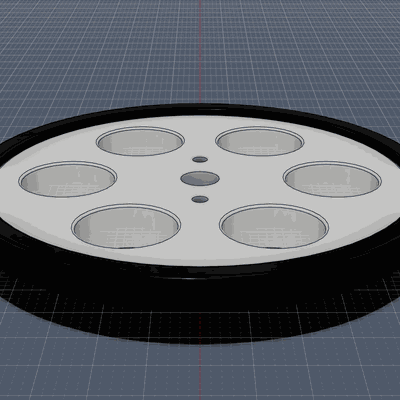
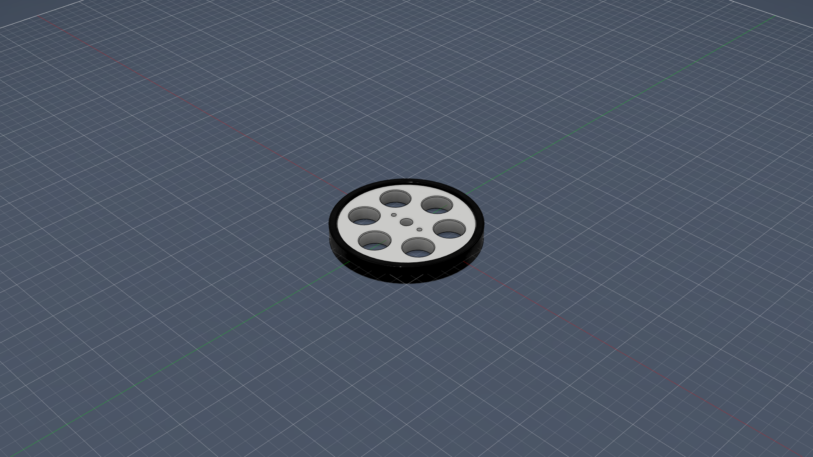
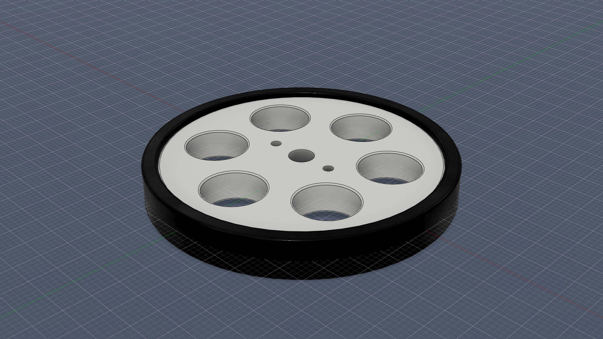
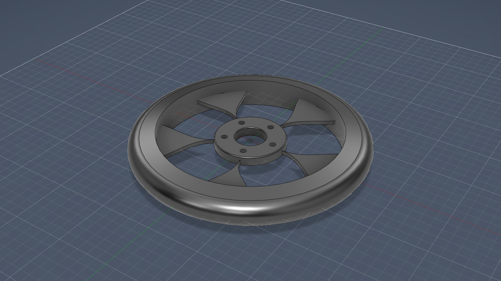
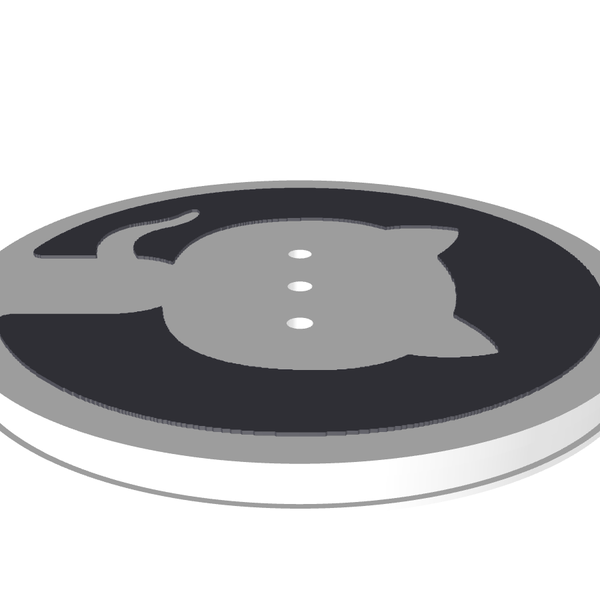
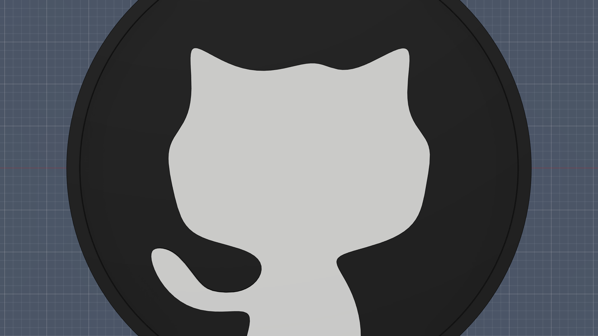
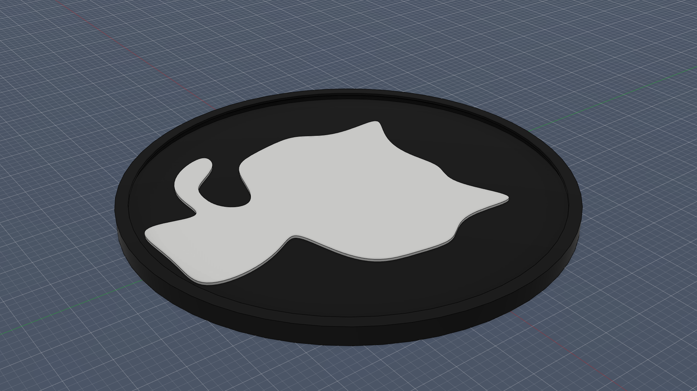
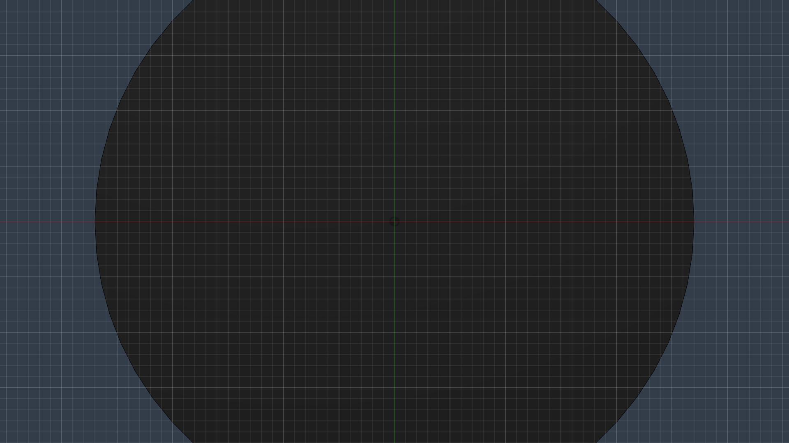

# 🏭 GitHub Copilot CLI × Fusion 360 MCP — AI で 3D CAD をターミナル操作

> **「秋月電子のこのタイヤを作って、ねじ穴も正確にくりぬいて」— それだけで Fusion 360 に 3D モデルが出来上がります。**

<p align="center">
  
</p>

---

## 📖 目次

- [これは何？](#-これは何)
- [アーキテクチャ](#-アーキテクチャ)
- [セットアップ（5分）](#-5-分でセットアップ)
- [使い方](#-使い方--こんなことが言えます)
- [作例](#-作例)
- [使えるツール（80種類）](#-使えるツール80-種類)
- [得意なこと / 苦手なこと](#-得意なこと---苦手なこと)
- [今後の可能性](#-今後の可能性)
- [トラブルシューティング](#-トラブルシューティング)

---

## 🇯🇵 これは何？

**GitHub Copilot CLI** と **Autodesk Fusion 360** を MCP（Model Context Protocol）で接続し、ターミナルに日本語で話しかけるだけで 3D モデルを自動生成するしくみです。

```
あなた: 「秋月電子のFS90R対応タイヤを再現して。ねじ穴も正確に」

Copilot: 商品ページをWeb検索 → 仕様を調査（外径60mm, 幅8mm, M2ネジ）
         → ホイールディスク押し出し → タイヤゴム回転体 → フィレット
         → 6回対称の肉抜き穴 → シャフト穴φ5mm → M2ネジ穴×3
         → 重心バランス検証 → 外観設定 → 完了 ✅
```

プログラミングも CAD の知識も不要。自然言語だけで設計できます。

---

## 🏗️ アーキテクチャ

```
┌─────────────┐     stdio      ┌──────────────────┐    TCP:9876    ┌──────────────┐
│  Copilot CLI │ ◄──────────► │  MCP Server      │ ◄────────────► │  Fusion 360  │
│  (WSL2)      │    MCP        │  (uvx, Python)   │                │  (Windows)   │
└─────────────┘               └──────────────────┘                │  + Add-in    │
                                                                   └──────────────┘
       あなた                   80種類のCADツール                     3D CAD エンジン
    自然言語で指示               を中継                                が実際に描画
```

使用した MCP サーバー: [faust-machines/fusion360-mcp-server](https://github.com/faust-machines/fusion360-mcp-server)（80 ツール搭載のコミュニティ版）

---

## 🚀 5 分でセットアップ

### 必要なもの

| ツール | 備考 |
|--------|------|
| [Autodesk Fusion](https://www.autodesk.com/products/fusion-360/) | 無料の個人利用ライセンスでOK |
| [GitHub Copilot](https://github.com/features/copilot) | 有料プラン（Pro / Business / Enterprise） |
| [GitHub CLI (`gh`)](https://cli.github.com/) | Copilot CLI の実行に必要 |
| WSL2 (Windows の場合) | Linux 環境として使用 |

### Step 1: uv をインストール（WSL2 側）

```bash
curl -LsSf https://astral.sh/uv/install.sh | sh
source ~/.local/bin/env
```

### Step 2: Fusion 360 アドインをインストール

```bash
git clone --depth 1 https://github.com/faust-machines/fusion360-mcp-server.git /tmp/fusion360-mcp
cp -r /tmp/fusion360-mcp/addon \
  "/mnt/c/Users/<ユーザー名>/AppData/Roaming/Autodesk/Autodesk Fusion 360/API/AddIns/Fusion360MCP"
rm -rf /tmp/fusion360-mcp
```

Fusion 360 で **Shift+S → Add-Ins → Fusion360MCP → Run** 。

### Step 3: Copilot CLI に MCP サーバーを登録

`~/.copilot/mcp-config.json` を作成：

```json
{
  "mcpServers": {
    "fusion360": {
      "type": "stdio",
      "command": "uvx",
      "args": ["fusion360-mcp-server", "--mode", "socket"],
      "env": {
        "PATH": "/home/<ユーザー名>/.local/bin:/usr/local/bin:/usr/bin:/bin"
      },
      "tools": ["*"]
    }
  }
}
```

### Step 4: WSL2 ネットワーク設定（⚠️ 重要）

WSL2 と Windows で `localhost` を共有するため、Windows 側に `C:\Users\<ユーザー名>\.wslconfig` を作成：

```ini
[wsl2]
networkingMode=mirrored
```

**作成後、PowerShell で `wsl --shutdown` → WSL を再起動。**

### Step 5: 接続確認

```bash
gh copilot    # Copilot CLI を起動
/mcp show     # fusion360 サーバーが表示されればOK 🎉
```

---

## 🎯 使い方 — こんなことが言えます

| あなたの指示 | Copilot がやること |
|-------------|-------------------|
| 「秋月電子のFS90Rタイヤを作って」 | 商品ページを調べて仕様通りにモデリング |
| 「M3ボルトを作って」 | 寸法を調べてネジ山付きボルトを生成 |
| 「Arduino Uno のケースを設計して」 | 基板寸法を調査 → 筐体を自動設計 |
| 「この部品をSTLでエクスポートして」 | 3Dプリンタ用ファイルを出力 |
| 「直径50mmの歯車を作って。歯数20」 | パラメトリックな歯車を生成 |
| 「スクリーンショットを撮って」 | Fusion のビューポートを画像保存 |

> 💡 **ポイント**: 部品の型番や商品URLを伝えるだけで、Copilot が自動的に Web 検索してデータシートから寸法を取得し、正確なモデルを作ります。

---

## 📸 作例

### 🛞 秋月電子 FS90R 対応タイヤ（G-13207）の再現

**指示**: *「[秋月電子のこの商品](https://akizukidenshi.com/catalog/g/g113207/)と同じタイヤを作りたい。ねじ穴も正確にくりぬいて」*

Copilot が自動的に行ったこと：
1. 秋月電子の商品ページを Web 検索し、仕様を調査（外径 60mm、幅 8mm、FS90R サーボ対応）
2. FEETECH FS90R-W のサーボシャフト仕様（φ5mm、M2ネジ）を追加調査
3. Fusion 360 でホイールディスク → タイヤゴム（回転体） → フィレット → 空洞（6回対称・力学バランス最適化）→ ねじ穴（3種類）の順に作成
4. 外観設定（ホイール: 白プラスチック、タイヤ: 黒ゴム）
5. 重心位置の検証（X/Y偏差 < 10⁻⁹ cm → 完璧な回転バランス）

<p align="center">
  
  
</p>

**再現した仕様：**

| 項目 | 値 |
|------|-----|
| 外径 | 60mm |
| 幅 | 8mm（タイヤゴム込み） |
| ホイール径 | 54mm |
| ホイール幅 | 6mm |
| 中心シャフト穴 | φ5mm（深さ 4mm） |
| M2 中心ネジ穴 | φ2mm（貫通） |
| M2 取り付け穴 | φ2mm × 2箇所（7mm 位置、180°対向） |
| 空洞（肉抜き穴）| φ12mm × 6箇所（6回対称、力学バランス最適化） |

### 🎨 ジェネレーティブ風タイヤホイール

**指示**: *「タイヤのジェネレーティブデザインを作って」*

スプライン曲線でタイヤ断面を描画 → レボリューション → Y字スポーク × 5本の円形パターン → ボルト穴 → フィレット仕上げ。

<p align="center">
  
</p>

### 🐙 Octocat ホイールキャップ

**指示**: *「この画像のOctocatをホイールキャップにして。空洞ではなく白黒の埋め込みで、スナップフィットでホイールに被せられるようにして」*

Copilot が自動的に行ったこと：
1. 画像からOpenCVで猫シルエットの輪郭を27点に抽出
2. Fusion 360 でキャップ本体（黒ディスクφ54mm）を作成
3. 27点フィットポイントスプラインでOctocat輪郭を描画 → 0.3mm浮き出し（白パーツ）
4. 裏面にスナップフィットリング（爪付き）でホイール外周に嵌め込み可能

<p align="center">
  
  
</p>
<p align="center">
  
  
</p>

---

## 🔧 使えるツール（80 種類）

Copilot は状況に応じて以下のツールを自動選択して使います：

| カテゴリ | 主なツール | できること |
|---------|-----------|-----------|
| **スケッチ** | `create_sketch`, `draw_rectangle`, `draw_circle`, `draw_line`, `draw_arc`, `draw_spline` | 2D プロファイル描画 |
| **3Dフィーチャー** | `extrude`, `revolve`, `sweep`, `loft`, `fillet`, `chamfer`, `shell` | 立体化・加工 |
| **プリミティブ** | `create_box`, `create_cylinder`, `create_sphere`, `create_torus` | 基本形状の直接生成 |
| **ボディ操作** | `boolean_operation`, `circular_pattern`, `rectangular_pattern`, `mirror` | 結合・切断・パターン |
| **アセンブリ** | `create_component`, `add_joint`, `create_rigid_group` | 部品の組立 |
| **計測・分析** | `measure_distance`, `get_physical_properties`, `check_interference` | 寸法・質量・干渉チェック |
| **パラメータ** | `create_parameter`, `set_parameter` | パラメトリック設計 |
| **エクスポート** | `export_stl`, `export_step`, `export_f3d` | ファイル出力 |
| **CAM** | `cam_create_setup`, `cam_create_operation`, `cam_post_process` | CNC 加工データ生成 |
| **コード実行** | `execute_code` | Fusion 内で任意の Python を実行 |

---

## ✅ 得意なこと / ❌ 苦手なこと

### 得意（すぐ使える）

- ✅ **単品パーツの設計** — ケース、ブラケット、歯車、タイヤ、スペーサーなど
- ✅ **型番を伝えるだけで正確なモデル** — Web 検索で寸法を自動調査
- ✅ **パラメトリック設計** — 後から寸法を変更できるパラメータ付き
- ✅ **STL / STEP / F3D エクスポート** — 3D プリンタや他の CAD に直接送れる
- ✅ **CAM / G コード生成** — 設計から CNC 加工データまでターミナルで完結
- ✅ **スクリーンショット・アニメーション** — ビューポートの画像保存・GIF 生成

### 苦手（まだ難しい）

- ❌ **複数部品のアセンブリ** — ジョイント拘束が不安定で位置ズレが起きる
- ❌ **ビジュアルフィードバックなし** — AI は画面を見ずに座標で設計するため、確認は手動
- ❌ **キャラクター・有機的形状** — 曲面が多い造形は苦手
- ❌ **長いスクリプトの連続実行** — `execute_code` のコンテキストが毎回リセットされる

> 💡 **おすすめの使い方**: 「AI にパーツの 8 割を作らせて、残り 2 割を手動で仕上げる」が最も効率的です。

---

## 💡 今後の可能性

### 今すぐ試せること

| ユースケース | 説明 |
|-------------|------|
| **🔩 パラメトリック部品生成** | 「M3×10 のボルトを作って」→ 標準部品を即座に生成 |
| **📦 基板から筐体を自動設計** | PCB の外形寸法を伝えて、ピッタリのケースを作成 |
| **⚙️ CAM → G コード出力** | 設計した部品の CNC 加工データをターミナルから生成 |
| **📐 2D 図面 → 3D 化** | DXF/SVG の寸法をもとに押し出しで立体化 |
| **🖨️ 3D プリント用に最適化** | フィレット追加、肉厚チェック、STL 出力まで一気通貫 |
| **📊 部品の質量・体積計算** | `get_physical_properties` で物理特性を即座に取得 |

### AI / MCP が進化したら

| ユースケース | 説明 |
|-------------|------|
| **📷 写真 → 3D モデル** | 実物の写真から寸法を推定してモデリング |
| **🔬 FEA → 自動最適化** | 強度解析の結果を AI が読んで形状を自動改善 |
| **🤖 マルチ AI 協調設計** | 構造 AI + 熱設計 AI + コスト AI が連携して最適化 |
| **🎙️ 音声入力モデリング** | 「もうちょっと丸くして」と話しかけて形状修正 |
| **🏢 Autodesk 公式 MCP 連携** | Fusion Data / Revit / Help MCP でプロジェクト管理から BIM まで |

---

## ⚠️ トラブルシューティング

| 症状 | 解決策 |
|------|--------|
| `Connection refused` | `.wslconfig` に `networkingMode=mirrored` を追加して `wsl --shutdown` |
| コマンドが 30 秒でタイムアウト | Fusion 360 のダイアログ（スクリプトとアドイン等）をすべて閉じる |
| `ping` は通るが他のコマンドが失敗 | アドインを Stop → Run で再起動 |
| MCP サーバーが見つからない | `~/.copilot/mcp-config.json` の PATH に `~/.local/bin` が含まれているか確認 |

---

## 📄 ライセンス

MIT License

## 🔗 参考リンク

- [faust-machines/fusion360-mcp-server](https://github.com/faust-machines/fusion360-mcp-server) — コミュニティ版 MCP Server（80 ツール）
- [Autodesk MCP Servers](https://www.autodesk.com/solutions/autodesk-ai/autodesk-mcp-servers) — Autodesk 公式 MCP ロードマップ
- [秋月電子 タイヤ FS90R対応](https://akizukidenshi.com/catalog/g/g113207/) — 今回再現した製品
- [GitHub Copilot CLI + MCP Docs](https://docs.github.com/en/copilot/how-tos/copilot-cli/customize-copilot/add-mcp-servers) — MCP サーバー追加方法
