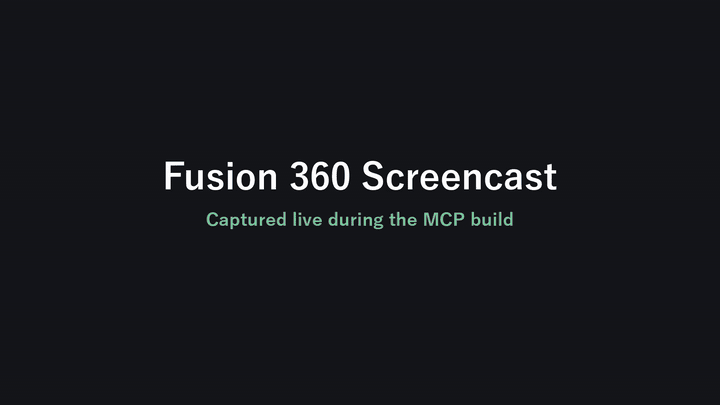

# Robot Arm Demo — Fusion 360 × GitHub Copilot CLI

**「会話するだけで CAD が動く」** — GitHub Copilot CLI と Fusion 360 が
MCP server を介してタッグを組み、関節付きロボットアームを共同で組み上げる技術デモ。

人間は自然言語で指示するだけ。
- 🧠 **Copilot CLI** が言葉を読み取り
- 🔌 **MCP server** が API 呼び出しに翻訳し
- 🛠️ **Fusion 360** が形にする

## 共同作業の流れ

| 役割 | 担当 |
|---|---|
| 「ロボットアームを作って」と話しかける | 👤 人間 |
| 意図を解釈して MCP ツール呼び出しに変換 | 🧠 Copilot CLI |
| API 呼び出しを Fusion へ橋渡し | 🔌 Fusion 360 MCP server |
| ボディ生成・カメラ操作・エクスポート | 🛠️ Fusion 360 |

## 構築されるロボットアーム

| 部位 | 形状 | 寸法 (cm) | 位置 |
|---|---|---|---|
| Base | 円柱 | r=6, h=2 | z=0..2 |
| YawJoint | 円柱 | r=2.5, h=3 | z=2..5 |
| UpperArm | 直方体 | 3×3×12 | 中心 z=11 |
| ElbowPivot | 円柱 | r=2, h=4 | y=-2..2, z=17 |
| Forearm | 直方体 | 2.5×2.5×10 | 中心 z=22 |
| GripperL/R | 直方体 | 0.6×2×3 | x=±1.5, z=28.5 |

## 共作の成果物

- `fusion_artifacts/robot_arm.f3d` — Copilot × Fusion で生成したフルデザイン
- `fusion_artifacts/robot_arm_upperarm.stl` — STL 例
